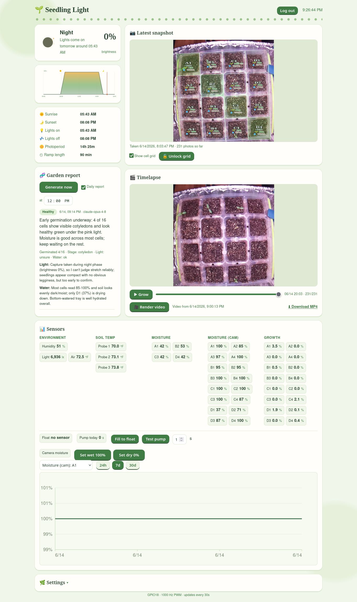

# Growlight

A self-contained seedling station for the Raspberry Pi: a sun-synced grow light,
a timelapse camera, camera-based moisture and growth tracking, optional automatic
watering, and a daily AI plant-health report, all driven from a single Flask
dashboard.

It runs on a Pi Zero 2 W controlling a cheap USB LED grow light through a MOSFET,
and grew from "dim a light on a schedule" into a small greenhouse controller.



*Light status and schedule, the latest snapshot with the cell grid, sensor charts,
the watering controls, and the daily AI plant-health report.*

---

## What it does

- **Sun-synced lighting.** Tracks local sunrise/sunset and drives the light with
  smooth fade-in/fade-out ramps via 1 kHz hardware PWM. Offsets, max brightness,
  and ramp length are all adjustable; a header graphic shows the current stage
  (moon at night drawn to the real lunar phase, sunrise, full sun, sunset).
- **Timelapse.** Captures a frame at a fixed interval during the photoperiod,
  holding the light at a constant brightness so every frame is exposed the same.
  Plays back in the browser frame-by-frame and renders an MP4 on-device.
- **Camera vision.** Per-cell soil moisture (from surface brightness) and a canopy
  growth index, overlaid on the latest photo as a grid, logged and charted.
- **Watering.** A submersible pump with a float switch can fill the tray to a set
  level. Heavily guarded with per-dose, cooldown, and daily caps. Fully automatic
  watering is off by default and should stay off until moisture is calibrated.
- **Daily AI report.** Sends the latest photo plus the sensor data to the Claude
  API and gets back a structured plant-health report: germination, growth stage,
  per-cell notes, best-effort species guesses, light/water assessment, concerns,
  and recommendations.
- **Alerts.** Pushes report summaries (and anything else you wire up) to your
  phone via ntfy and/or a Discord channel.
- **Dashboard.** Live-editable settings, sensor charts, the timelapse player, and
  the report card. Read-only until you log in.

---

## Hardware

| Part | Detail |
| --- | --- |
| Computer | Raspberry Pi Zero 2 W (64-bit Raspberry Pi OS) |
| Light | 5 V USB LED grow light, ground switched low-side through an XY-MOS D4184 MOSFET |
| Camera | Raspberry Pi camera |
| Pump | 5 V USB submersible pump through a second D4184 + 1N5819 flyback diode, on its own 5 V supply with a common ground |
| Float | Normally-open float switch in the destination tray |

### Pinout (BCM)

| Signal | GPIO | Physical pin | Notes |
| --- | --- | --- | --- |
| Light PWM | 18 | 12 | Hardware PWM, 1 kHz, to the light MOSFET gate |
| Pump | 24 | 18 | To the pump MOSFET gate (needs a separate 5 V brick + common ground) |
| Float | 23 | 16 | Internal pull-up; other leg to GND. Disabled until wired (`FLOAT_ENABLED` in `sensors.py`) |

Enable hardware PWM on GPIO18 by adding to `/boot/firmware/config.txt`:

```
dtoverlay=pwm,pin=18,func=2
```

**Float fail-safe.** Mount the float so that rising water *opens* the switch. Open
(reads "full") means stop, which is also the broken-wire state, so a disconnected
float fails safe by refusing to pump.

**Pump siphoning.** A float only cuts the pump; it can't stop a siphon. Either keep
the discharge above the water line or drill a ~1.5 mm vent hole at the top of the
tubing run.

Wiring diagrams are in `growlight_wiring.svg`, `pump_float_wiring.svg`, and
`sensor_wiring.svg`.

---

## Install

On the Pi:

```bash
git clone <your-repo-url> ~/growlight
cd ~/growlight
python3 -m venv venv
./venv/bin/pip install flask astral rpi-hardware-pwm gpiozero werkzeug
sudo apt install -y python3-lgpio ffmpeg
```

`gpiozero` needs the `lgpio` backend. The pip build of `lgpio` is fragile on the
Pi, so install the system package (`python3-lgpio`) and let the venv see it by
setting `include-system-site-packages = true` in `venv/pyvenv.cfg`.

Run it directly to test:

```bash
./venv/bin/python growlight.py
```

The dashboard comes up on `http://<pi-ip>:5000`.

### Run as a service

Create `/etc/systemd/system/growlight.service`:

```ini
[Unit]
Description=Growlight controller
After=network-online.target

[Service]
User=ben
WorkingDirectory=/home/ben/growlight
ExecStart=/home/ben/growlight/venv/bin/python /home/ben/growlight/growlight.py
Restart=on-failure

[Install]
WantedBy=multi-user.target
```

```bash
sudo systemctl enable --now growlight
```

### Deploy updates

```bash
cd ~/growlight && git pull && sudo systemctl restart growlight
```

Then hard-refresh the dashboard (Ctrl-Shift-R) so the browser picks up new
JS/CSS.

---

## Configuration

Settings live in `config.json` (created on first run, gitignored). Most are
editable from the dashboard Settings panel; the rest are edited in the file.

| Key | Default | Meaning |
| --- | --- | --- |
| `latitude` / `longitude` / `timezone` | Thousand Oaks, CA | Location for sun times |
| `max_bright` | 100 | Peak brightness (%) |
| `ramp_min` | 30 | Fade-in/out length (minutes) |
| `sunrise_offset_min` / `sunset_offset_min` | 0 | Shift the on/off times |
| `capture_enabled` | false | Timelapse on/off |
| `capture_interval_min` | 30 | Minutes between frames |
| `capture_brightness` | 100 | Brightness held during each photo |
| `roi` | "" | Crop as `x,y,w,h` fractions, blank = full frame |
| `sample_interval_min` | 5 | Sensor logging interval |
| `auto_water` | false | Master switch for automatic watering (keep off until calibrated) |
| `pump_max_seconds` | 20 | Cap on a single dose |
| `pump_cooldown_min` | 30 | Minimum wait between auto doses |
| `pump_daily_max_seconds` | 180 | Daily runaway backstop |
| `fill_max_seconds` | 60 | Cap on a fill-to-float run if the float never trips |
| `ntfy_topic` | "" | Set to enable ntfy push |
| `discord_webhook` | "" | Set to enable Discord alerts |
| `ai_enabled` | false | Daily AI report on/off |
| `ai_model` | `claude-opus-4-8` | Claude model for the report |
| `ai_report_hour` / `ai_report_minute` | 8:00 | When the daily report runs |
| `ai_notify` | true | Push the report summary |
| `ai_notes` | (grow description) | Context handed to the AI; list what you planted here to sharpen species guesses |

### Secrets (all gitignored)

| File | Purpose |
| --- | --- |
| `.secret` | Flask session key (auto-generated) |
| `.anthropic_key` | Claude API key for the AI report (or set `ANTHROPIC_API_KEY`) |
| `.discord_webhook` | Discord webhook URL (or put it in `config.json`) |

```bash
echo 'sk-ant-...'                              > ~/growlight/.anthropic_key
echo 'https://discord.com/api/webhooks/...'    > ~/growlight/.discord_webhook
chmod 600 ~/growlight/.anthropic_key ~/growlight/.discord_webhook
```

---

## Features in detail

### Authentication

With `password_hash` blank the dashboard is fully open. Set a password to make it
read-only until login (viewing stays open; editing, rendering, watering, and
settings require a session):

```bash
./venv/bin/python scripts/set_password.py
```

Behind HTTPS keep `cookie_secure: true`; for plain-http local testing set it
false.

### Camera moisture & growth

`growth.py` runs as a subprocess against the latest frame. Moisture is the median
surface brightness of the soil per cell (darker = wetter), which is robust under
the magenta grow light where colour-based methods fail. Growth is an excess-green
canopy index, a relative tracker, understated under coloured light.

Calibrate moisture per cell with the "Set wet 100%" / "Set dry 0%" buttons after a
capture lands. Define the cell grid by dragging its corners on the photo (or the
Detect button), then lock it.

### Watering

`run_pump(seconds)` does a timed dose; `run_pump_until_full()` fills until the
float trips, debounced against slosh, with `fill_max_seconds` as a backstop that
flags a dry reservoir. Both honour the per-dose, cooldown, and daily caps and
always force the pump off in a `finally`. Keep `auto_water` off until moisture is
calibrated and the seedlings are established; overwatering (damping-off) is the
number-one seedling killer.

### Daily AI report

When enabled, the controller sends the latest photo (downscaled) plus the current
data to the Claude API once a day at the configured time, and shows the result on
the dashboard while pushing the summary to ntfy/Discord. A restart does **not**
regenerate the report; it keeps the last one. New reports come only from crossing
the scheduled time or pressing "Generate now". Cost is roughly a cent or two per
report.

### Alerts

`notify.py` (ntfy) and `discord_alert.py` (Discord webhook) are independent
transports; either fires if configured. Test them:

```bash
./venv/bin/python notify.py "test"
./venv/bin/python discord_alert.py "test"
```

---

## Reverse proxy

A separate box runs nginx and proxies the dashboard to the public site over HTTPS:

```nginx
location / {
    proxy_pass http://grow:5000;
    proxy_set_header X-Forwarded-Proto $scheme;
}
```

---

## API

Read endpoints are open; mutating ones require a session when a password is set.

| Method | Path | Purpose |
| --- | --- | --- |
| GET | `/api/status` | Full state: light, sensors, water, settings, auth |
| GET | `/api/series` | Sensor history for charts |
| GET | `/api/photos`, `/photo/latest`, `/thumb/<name>` | Timelapse frames |
| GET | `/video` | Rendered MP4 |
| GET | `/api/float` | Fast float read |
| GET | `/api/report` | Latest AI report + generating flag |
| POST | `/api/settings` | Update light/capture settings |
| POST | `/api/grid`, `/api/detect_grid` | Cell grid |
| POST | `/api/dryness_cal` | Capture a wet/dry moisture anchor |
| POST | `/api/render` | Render the timelapse MP4 |
| POST | `/api/pump` | Timed dose or fill-to-float |
| POST | `/api/ai_settings`, `/api/report` | AI report config / generate now |
| POST | `/api/login`, `/api/logout` | Auth |

---

## Project layout

```
growlight.py        main app: light/capture/sample/watering/report loops + Flask
db.py               SQLite logging (WAL) with downsampling
sensors.py          sensor I/O, float switch
growth.py           per-cell moisture + canopy vision (subprocess)
detect_corners.py   grid corner auto-detect (subprocess)
notify.py           ntfy push transport
discord_alert.py    Discord webhook transport
ai_report.py        Claude API daily report
templates/index.html, static/{app.js,style.css}
scripts/set_password.py
setup.sh, test_ramp.py
```

Runtime files (`config.json`, `growlight.db`, `timelapse/`, `.secret`,
`.anthropic_key`, `.discord_webhook`, `ai_report.json`) are gitignored.


